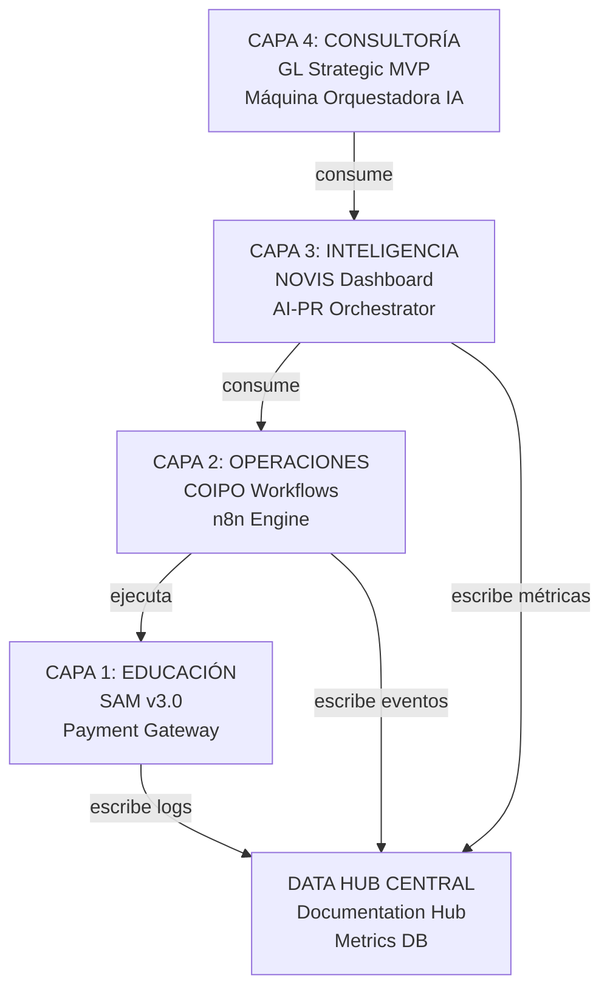

# ARCHITECTURE.md - Arquitectura del Ecosistema CarlosVergaraChile

## Visión General: 4 Capas
**Última actualización: 9 Enero 2026**

---

## Diagrama de Capas



---

## CAPA 1: EDUCACIÓN (Core Platform)

### Componentes Principales
- **SAM v3.0**: Sistema Asistente de Maestros
  - Material Generator (genera contenido educativo)
  - Test Evaluator (evalúa pruebas manuscritas)
  - Course Dashboard (gestiona cursos)
  - Payment Integration (Mercado Pago)

### Responsabilidades
- ✍️ Crear y gestionar contenido educativo
- 📄 Evaluar respuestas de estudiantes
- 💳 Procesar pagos
- 👥 Gestionar usuarios y matrículas

### Eventos Generados
- `course.started`
- `course.completed`
- `evaluation.submitted`
- `evaluation.processed`
- `payment.received`
- `payment.failed`

### Bases de Datos
- Users collection
- Courses collection
- Evaluations collection
- Payments log

---

## CAPA 2: OPERACIONES (Orchestration Layer)

### Componentes Principales
- **COIPO**: Orchestrator con n8n
  - Workflow Manager (n8n)
  - OAuth2 Authentication
  - Gmail Integration
  - Event Processor

### Responsabilidades
- ⚡ Ejecutar workflows automatizados
- 📧 Enviar notificaciones
- 🔐 Autenticar usuarios
- 📨 Procesar eventos entrantes

### Integraciones Externas
- n8n (workflow engine)
- Gmail API (notifications)
- OAuth2 providers (Google, GitHub, etc.)

### Eventos Consumidos
- `course.started` → Enviar bienvenida
- `evaluation.submitted` → Procesar autoáticamente
- `payment.received` → Confirmar y notificar

### Eventos Generados
- `workflow.triggered`
- `workflow.completed`
- `notification.sent`
- `task.assigned`

---

## CAPA 3: INTELIGENCIA (AI & Analytics Layer)

### Componentes Principales
- **NOVIS Executive Dashboard**
  - Real-time metrics
  - AI-powered insights
  - Predictive analytics

- **AI-PR Orchestrator**
  - Multi-AI PR reviews (ChatGPT, Claude, DeepSeek, etc.)
  - Automated code analysis
  - Intelligent suggestions

### Responsabilidades
- 📊 Recolectar y analizar datos
- 🖔 Detectar patrones y anomalías
- 🤖 Generar recomendaciones con IA
- 📈 Crear reportes ejecutivos

### Datos Consumidos
- SAM metrics (user activity, completions)
- COIPO events (workflow execution times)
- GitHub data (PR metrics, code quality)

### Eventos Generados
- `metric.updated`
- `alert.raised`
- `report.generated`
- `recommendation.generated`

### APIs Externas
- OpenAI (ChatGPT)
- Anthropic (Claude)
- DeepSeek API
- Google Gemini
- GitHub API

---

## CAPA 4: CONSULTORÍA (Services Layer)

### Componentes Principales
- **GL Strategic MVP**
  - Strategic consulting platform
  - Client projects
  - Recommendations engine

- **Máquina Orquestadora IA**
  - Advanced AI orchestration
  - Multi-model coordination
  - Human decision simulation

- **Strategic Websites**
  - Corporate site
  - Marketing pages
  - Public presence

### Responsabilidades
- 🎯 Consultoría estratégica
- 📄 Elaborar reportes personalizados
- 🤖 Generar recomendaciones
- 👥 Gestionar relaciones con clientes

### Datos Consumidos
- NOVIS analytics
- SAM course performance
- Market trends
- Historical data

---

## DATA HUB CENTRAL

### Responsabilidades
- 📚 Centralizar logs de todos los sistemas
- 📇 Almacenar métricas históricas
- 📈 Dashboard central de KPIs
- 🗓️ Auditoría y compliance

### Componentes
- **documentation-hub**: Central repository
- **Metrics Database**: Time-series data
- **Log Aggregation**: ELK Stack / CloudWatch
- **Central Dashboard**: dashboard-proyectos

---

## Flujos de Datos

### Flujo 1: Usuario Estudia en SAM
```
1. Usuario entra a SAM
2. SAM carga material generado
3. SAM emite evento: course.started
4. COIPO recibe evento
5. COIPO envía notificación (Gmail)
6. NOVIS registra en analytics
7. dashboard-proyectos actualiza KPI
```

### Flujo 2: Evaluación Automática
```
1. Estudiante envía prueba
2. SAM emite: evaluation.submitted
3. COIPO inicia evaluación
4. SAM procesa y califica
5. SAM emite: evaluation.processed
6. NOVIS analítica
7. GL Strategic puede acceder a reportes
```

### Flujo 3: Revisión de PR
```
1. PR creado en GitHub
2. AI-PR-Orchestrator disparado
3. Múltiples modelos de IA analizan
4. Review generado y publicado
5. NOVIS registra estadísticas
6. dashboard-proyectos muestra métricas
```

---

## Convenciones de Nombres

### Eventos
- `{entity}.{action}`: `course.started`, `user.created`
- Siempre en passé: `submitted`, `processed`, `completed`

### APIs
- RESTful: `/api/v1/{resource}`
- Webhooks: POST to `/webhooks/{entity}-{event}`
- WebSockets: `wss://domain/ws/{topic}`

### Databases
- MongoDB collections: plural snake_case
  - `users`, `courses`, `evaluations`
- Indexes: `{entity}_{field}_1`

---

## Patrones de Comunicación

### Síncrono
- REST APIs para operaciones críticas
- Timeouts: 30s máximo

### Asíncrono
- Webhooks para eventos
- Message queue (n8n) para workflows
- WebSockets para real-time (NOVIS dashboard)

### Fallbacks
- Circuit breakers en todas las integraciones
- Retries con exponential backoff
- Caching de datos críticos

---

## Seguridad

### Autenticación
- OAuth2 para terceros
- JWT tokens para APIs
- Session management en SAM

### Autorización
- RBAC: Admin, Teacher, Student, Analyst
- Scope-based para APIs

### Datos
- Encriptación en tránsito (HTTPS/TLS)
- Encriptación en reposo para datos sensibles
- GDPR compliance para PII

---

## Monitoreo y Observabilidad

### Métricas
- Request latency (p50, p95, p99)
- Error rates por endpoint
- Database query performance
- Event processing delay

### Logs
- JSON format para fácil parsing
- Structured logging (timestamp, level, service, message)
- Centralized en documentation-hub

### Alertas
- >5% error rate → critical
- Latency >1s → warning
- Database size >10GB → alert
- API down → immediate notification

---

## Scaling Strategy

### Horizontal
- Stateless APIs en containers
- Load balancing (Vercel, AWS ALB)
- Database replication (MongoDB replica set)

### Vertical
- Database optimization (indexes, queries)
- Caching layer (Redis, CDN)
- Async processing para heavy tasks

---

## Versionado
- APIs: Semantic versioning (/v1/, /v2/)
- Databases: Migration scripts con timestamps
- Contracts: BREAKING CHANGES require major version bump

*Arquitectura definida el 9 Enero 2026*
